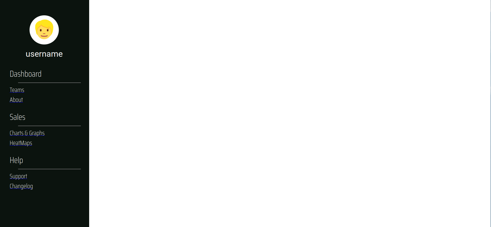

# DashBoss
Business management dashboard created in React




## Why this app as created: 

Proof of concept: 

## How to use:

1. Clone repo into desired directory ```git clone https://github.com/Toughee/DashBoss.git``` or ```gh repo clone Toughee/DashBoss```
2. Run ```npm install``` in your terminal to install all app node modules and dependencies
3. Run ```yarn start``` in your terminal to run app on http://localhost:3000/

## Testing tools used for app:

- React Testing library
- Jest
- Cypress
- TravisCI
- CircleCI

## Project resources:

- [Current roadmap for app](https://github.com/Toughee/DashBoss/projects/1)
- [Wiki page for app](https://github.com/Toughee/DashBoss/wiki)
- [Documentation for project contributors](https://github.com/Toughee/DashBoss/tree/main/docs)


### Completed app tasks:

- [x] Include CircleCI and Travis-CI inside project


### Future app goals:

- [ ] Develop tests for each React component
- [ ] Better U/I scheme for app
- [ ] Add interactive map section for app