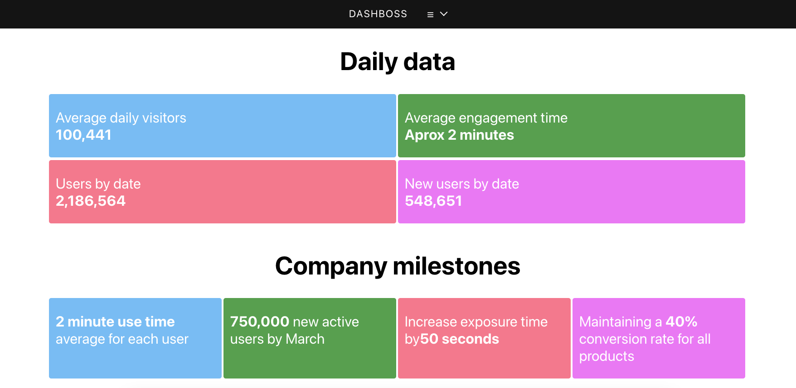

# DashBoss
Business management dashboard created in React



## Why this app as created: 

Proof of concept: This app was created to serve as both as an example for a Dashboard app created in React, and as a free resource for anybody interested in using it for any of their projects. It currently keeps a changelog inside the app, an active roadmap for future app features and bug fixes, and a wiki page to describe the project better. Pull requests and feature requests are more than welcome, as well as volunteers for anyone interested in improving DashBoss.  

## How to use:

1. Clone repo into desired directory ```git clone https://github.com/Toughee/DashBoss.git``` or ```gh repo clone Toughee/DashBoss```
2. Run ```npm install``` in your terminal to install all app node modules and dependencies
3. Run ```yarn start``` in your terminal to run app on http://localhost:3000/

## Testing tools used for app:

- React Testing library
- Jest
- Cypress
- TravisCI
- CircleCI

## Project resources:

- [Current roadmap for app](https://github.com/Toughee/DashBoss/projects/1)
- [Wiki page for app](https://github.com/Toughee/DashBoss/wiki)
- [Documentation for project contributors](https://github.com/Toughee/DashBoss/tree/main/docs)

### Completed app tasks:

- [x] Include CircleCI and Travis-CI inside project
- [x] Improve U.I. design for app
- [x] Improve U.X. for sales data
- [x] Add interactive map component section for sales by region
- [x] Resolve current ES module error: ```require() of ES modules is not supported.```
### Future app goals:

- [ ] Develop tests for each React component
- [ ] Organize all sales metrics and data into one React Database component
- [ ] Add option for users to change their username